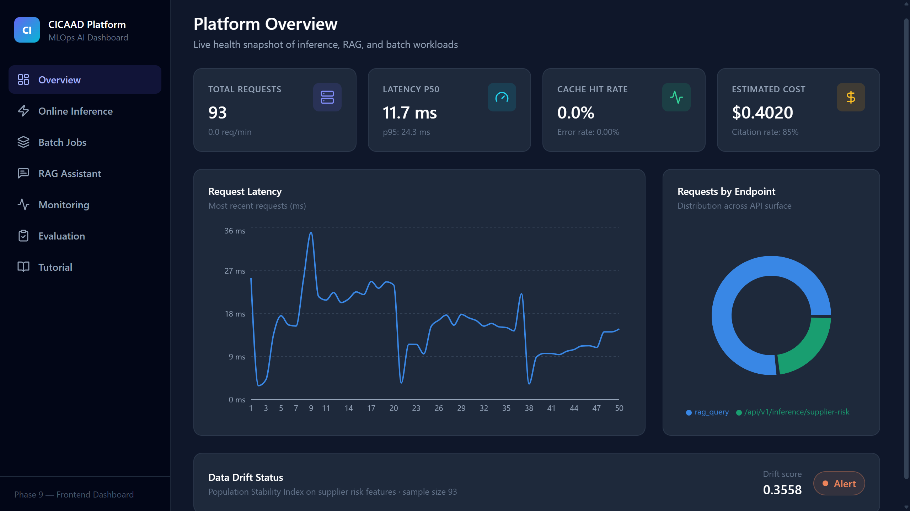
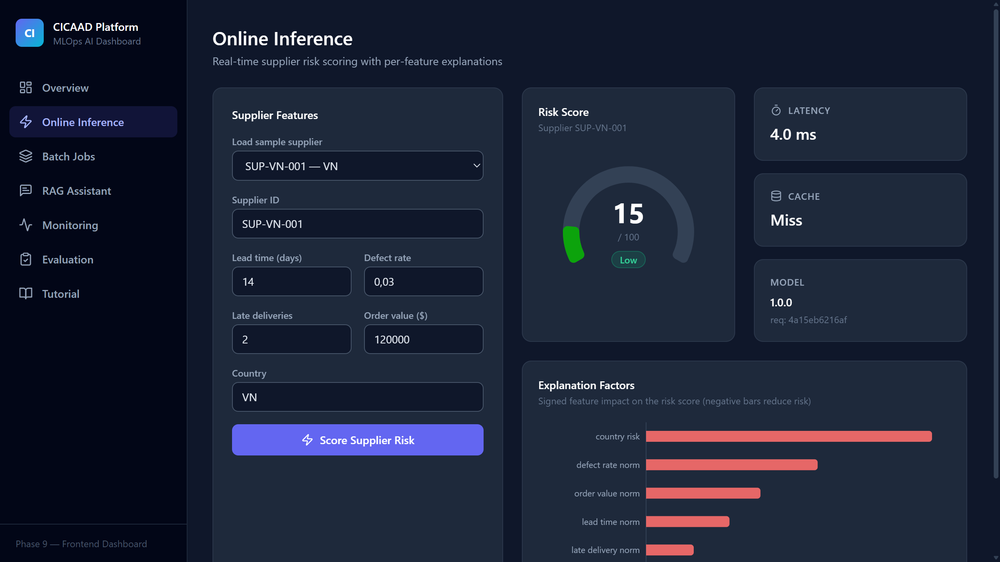
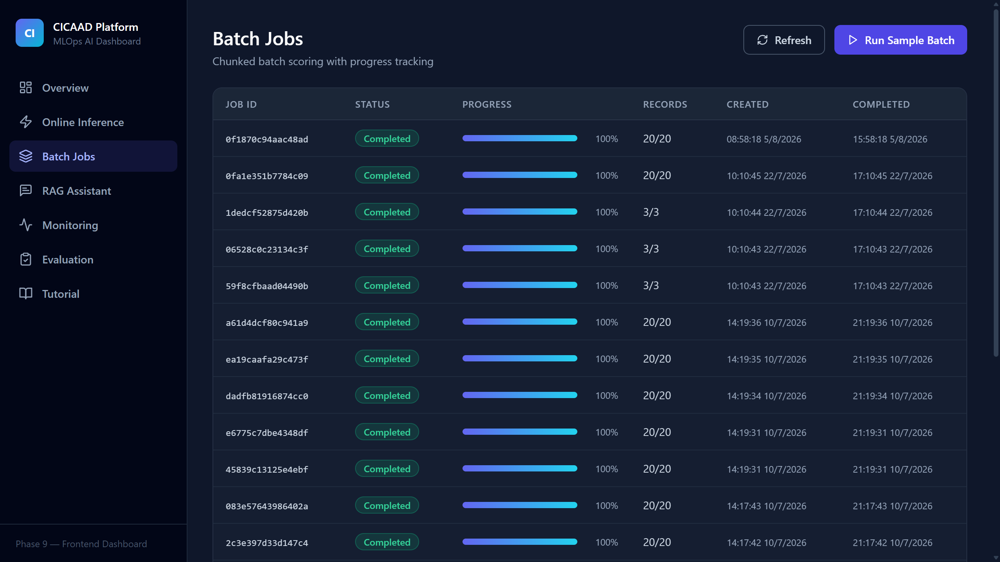
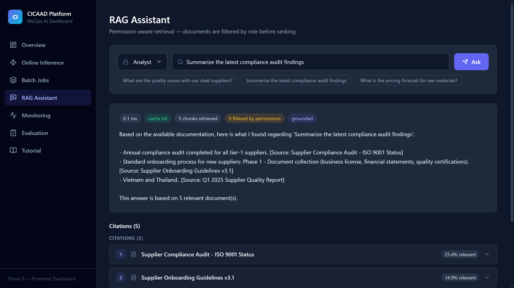
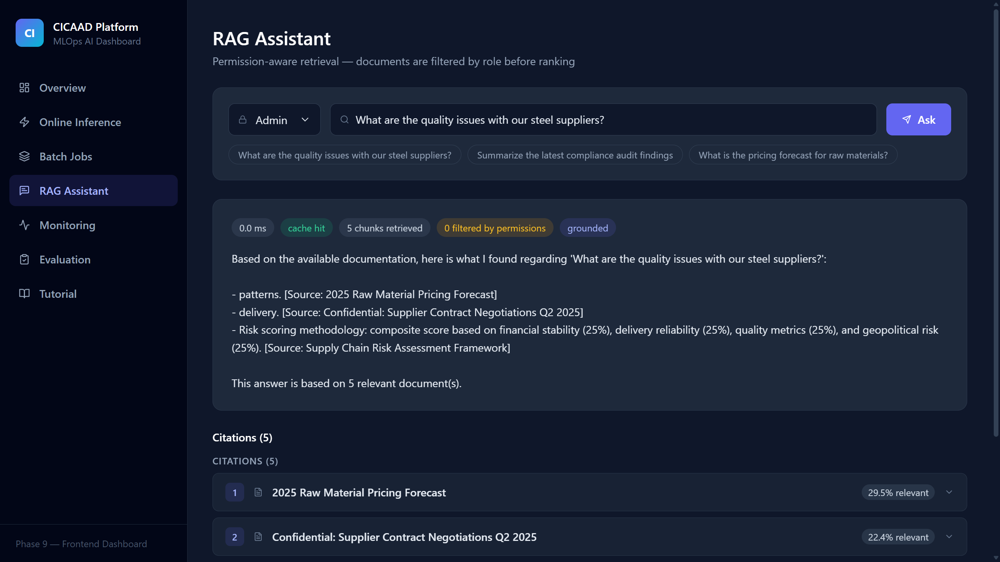
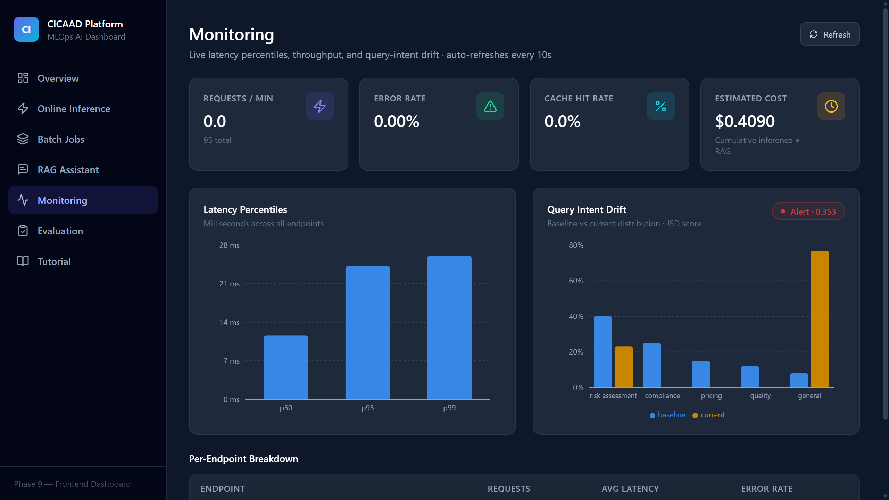
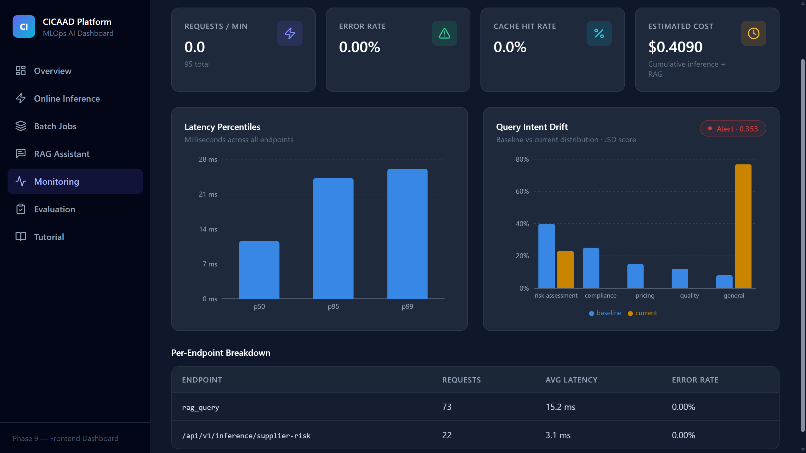
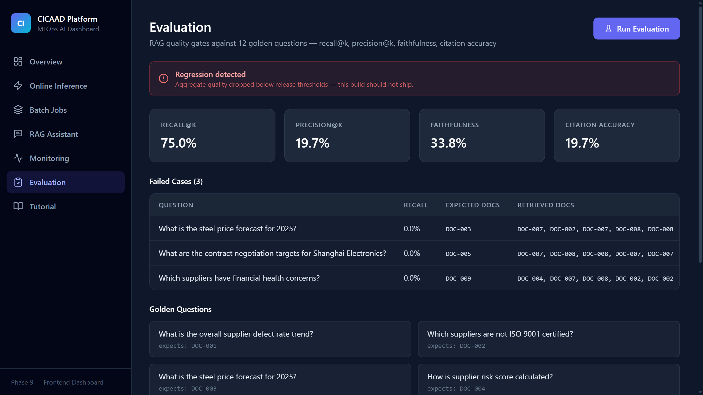
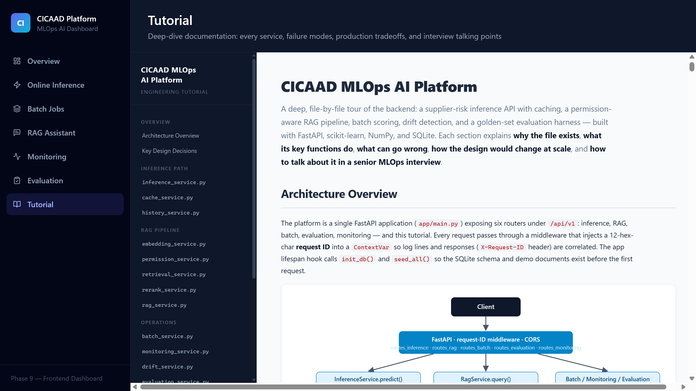

# CICAAD MLOps AI Platform

A production-inspired **MLOps + GenAI platform** for B2B manufacturing / supply chain: online ML inference, batch scoring, permission-aware RAG, evaluation, monitoring, caching, and drift detection — with a full React dashboard.

> Built as a portfolio demonstration of AI Platform Engineering: the architecture, failure-mode handling, and tradeoffs mirror what a real production system needs, using local-friendly components (SQLite, in-process vector store, mock LLM) that are swappable for production equivalents.

## Screenshots

### Platform Overview
Live health snapshot — request volume, latency percentiles, cache hit rate, cost, and drift status at a glance.



### Online Inference
Real-time supplier risk scoring with a gauge, per-feature explanation factors, latency, and cache info.



### Batch Jobs
Chunked CSV scoring with live progress bars, retry handling, and per-job results.



### RAG Assistant — Permission-Aware Retrieval
The same pipeline behaves differently per role. As **analyst**, 9 chunks are filtered out by permissions before ranking:



As **admin**, nothing is filtered — full document access:



### Monitoring
Latency percentiles (p50/p95/p99), throughput, error rate, and query-intent drift (baseline vs current, JSD score) with warning states.



Per-endpoint breakdown with request counts, average latency, and error rates:



### Evaluation
RAG quality gates against golden questions — recall@k, precision@k, faithfulness, citation accuracy, failed-case drill-down, and a regression banner that blocks bad builds.



### Tutorial
Built-in engineering documentation served by the backend: file-by-file deep dive with failure modes, production tradeoffs, and interview talking points.



## Why This Project Exists

Most ML demos stop at "model returns a prediction." Production AI platforms need much more:

- **Serving discipline** — caching, request tracing, latency percentiles, request history
- **Security** — permission-aware retrieval where access control happens *before* ranking, not after
- **Operations** — drift detection, error rates, cost tracking, batch job orchestration with retry
- **Quality gates** — automated RAG evaluation (recall@k, faithfulness, citation accuracy) with regression detection

This project implements all of that end-to-end.

## Architecture

```
┌─────────────────────────── React Dashboard (Vite + TS + Tailwind + Recharts) ───────────────────────────┐
│  Overview │ Online Inference │ Batch Jobs │ RAG Assistant │ Monitoring │ Evaluation │ Tutorial          │
└───────────────────────────────────────────────┬──────────────────────────────────────────────────────────┘
                                                │ REST (axios, /api proxy)
┌───────────────────────────────────────────────▼──────────────────────────────────────────────────────────┐
│                                    FastAPI (app/main.py)                                                 │
│  routes_inference  routes_batch  routes_rag  routes_monitoring  routes_evaluation  routes_tutorial       │
├──────────────────────────────────────────────────────────────────────────────────────────────────────────┤
│  Services                                                                                                 │
│  inference ──► feature_builder ──► model_registry ──► supplier_risk_model (rule-based / sklearn)         │
│  rag ──► embedding (mock/ST) ──► permission (RBAC pre-filter) ──► retrieval ──► rerank ──► answer+cite   │
│  batch (threaded chunked scoring + retry)   monitoring (p50/p95/p99, RPM, cost)   drift (JSD)            │
│  evaluation (golden questions → recall@k / precision@k / faithfulness / citation accuracy)               │
│  cache (LRU + SQLite, composite keys)       history (request log)                                        │
├──────────────────────────────────────────────────────────────────────────────────────────────────────────┤
│  Storage: SQLite (history, jobs, cache) │ NumPy vector store (cosine, pre-filtered search) │ seed data   │
└──────────────────────────────────────────────────────────────────────────────────────────────────────────┘
```

## Quickstart

### Local

```bash
# Backend
cd backend
python -m venv .venv
.venv/Scripts/activate        # Windows — use source .venv/bin/activate on Unix
pip install -r requirements.txt
uvicorn app.main:app --reload  # http://localhost:8000/docs

# Frontend (separate terminal)
cd frontend
npm install
npm run dev                    # http://localhost:5173 (proxies /api to :8000)
```

### Docker

```bash
docker-compose up --build
# Frontend: http://localhost:3000 — Backend: http://localhost:8000/docs
```

### Tests

```bash
cd backend && pytest tests/ -v
```

## API Examples

**Online inference**

```bash
curl -X POST http://localhost:8000/api/v1/inference/supplier-risk \
  -H "Content-Type: application/json" \
  -d '{"supplier_id":"SUP_001","lead_time_days":14,"defect_rate":0.03,"late_delivery_count":2,"order_value":50000,"country":"VN"}'
```

Returns `risk_score`, `risk_level`, per-factor `explanation`, `latency_ms`, `cache_hit`, `model_version`.

**Permission-aware RAG**

```bash
curl -X POST http://localhost:8000/api/v1/rag/query \
  -H "Content-Type: application/json" \
  -d '{"user_id":"u1","role":"analyst","query":"What are the quality issues with our steel suppliers?","top_k":5}'
```

Same query as `viewer` retrieves fewer documents — confidential docs are filtered out *before* vector ranking.

**Batch scoring**

```bash
curl -X POST http://localhost:8000/api/v1/batch/run-sample
curl http://localhost:8000/api/v1/batch/jobs/<job_id>
```

**Monitoring & evaluation**

```bash
curl http://localhost:8000/api/v1/monitoring/metrics
curl -X POST http://localhost:8000/api/v1/evaluation/run -H "Content-Type: application/json" -d '{"top_k":5,"role":"analyst"}'
```

## Key Engineering Decisions

| Decision | Rationale |
|---|---|
| **Pre-filtering RAG security** | Permission filter runs *inside* vector search, before ranking. Post-filtering leaks information through scores and can return short results; pre-filtering makes unauthorized documents invisible to the query. |
| **Rule-based model as production default** | A deterministic weighted-scoring model guarantees the platform works with zero training artifacts, is fully explainable, and demonstrates the registry/versioning machinery. A sklearn model can be registered as a canary without touching serving code. |
| **Composite cache keys** | Cache keys hash `namespace + role + input + model_version` — so a model deploy or role difference never serves stale/leaked results. |
| **JSD drift detection** | Query-intent distribution compared against a baseline with Jensen-Shannon divergence — symmetric, bounded [0,1], robust to zero bins. Thresholds map to ok/warning/alert. |
| **Mock embeddings via HashingVectorizer** | Deterministic, no model download, works offline/in CI. Swappable for sentence-transformers via config (`EMBEDDING_PROVIDER`). |
| **Deterministic mock answer generator** | RAG answers are template-composed from retrieved chunks when no LLM key is configured — the full pipeline (retrieve → rerank → cite) is real; only generation is simulated. Architecture is LLM-ready. |

## Production Tradeoffs

What would change at scale:

- **SQLite → Postgres** for history/jobs; **in-process vector store → pgvector/Qdrant/OpenSearch** with metadata filtering pushed to the engine
- **Thread-based batch → Celery/queue workers** with idempotency keys and dead-letter handling
- **In-memory cache → Redis** with cluster-wide invalidation on model deploys
- **Mock LLM → provider API** behind the same `_generate_answer` seam, plus output guardrails
- **Metrics from SQLite → Prometheus + Grafana**; drift job on a scheduler instead of on-request
- Secrets to a vault, authn via OIDC/JWT instead of trusted `role` field in the request body

## Interview Talking Points

- Why pre-filtering (not post-filtering) is the only safe RBAC pattern for RAG
- How composite cache keys prevent both stale results after deploys and cross-role data leaks
- Evaluation as a release gate: recall@k regression blocks a bad index/embedding change
- Single prediction code path shared by online API and batch scoring — no training/serving skew between modes
- Drift on *query intent distribution* as a leading indicator, before label-based model drift is measurable

## Project Structure

```
backend/
  app/
    api/         # FastAPI routers (inference, batch, rag, monitoring, evaluation, tutorial)
    core/        # config (pydantic-settings), logging, tracing
    ml/          # feature_builder, supplier_risk_model, model_registry
    schemas/     # Pydantic request/response models
    services/    # inference, batch, rag, embedding, permission, retrieval, rerank,
                 # cache, history, monitoring, drift, evaluation
    storage/     # SQLite database, repositories, vector store, seed data
  tests/         # 28 pytest tests
  tutorial.html  # in-depth learning documentation (served at /api/v1/tutorial)
frontend/
  src/pages/     # Overview, OnlineInference, BatchJobs, RagAssistant, Monitoring, Evaluation, Tutorial
  src/components/# MetricCard, DataTable, StatusBadge, CitationPanel, ...
.github/workflows/ci.yml   # backend tests + frontend build
docker-compose.yml
```

## License

MIT
